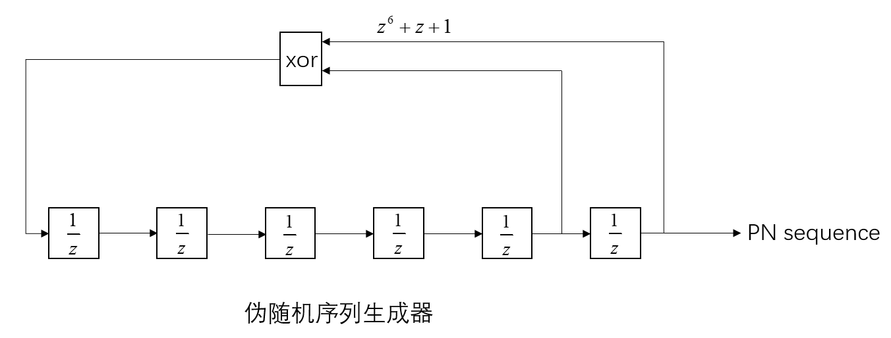
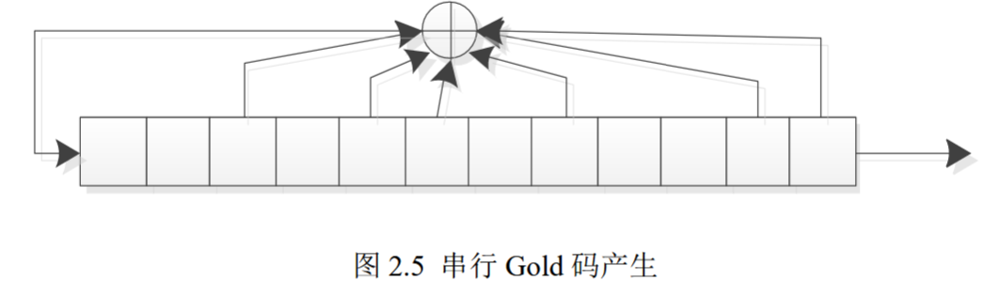
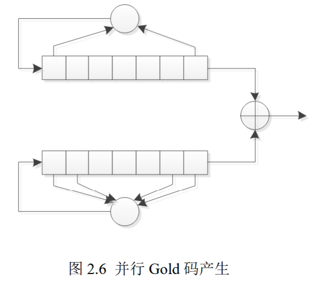
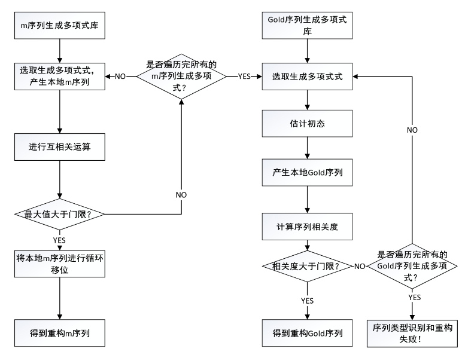

# 含错扩频码参数估计及重构

## 一、伪随机码

​	伪随机码的种类有三种：m序列、组合码和非线性码。

### 1、m序列

#### (1)、m序列生成器	

​	m序列即同步扰码的加扰序列，m序列寄存器为n级，周期为$2^n-1$，伪随机序列框图如下所示：

#### (2)、相关特性

​	对于序列$a$，将0，1映射为1，-1得到序列$a'$，即$a'=1-2a$。
$$
R(\tau)=\frac{1}{N}\sum\limits_{k=1}^{N}a'_ka'_{k+\tau}=\begin{cases}1,&\tau=0\\-\frac{1}{N},&\tau=1,2,\dots,N-1\end{cases}
$$

### 2、[Gold码](./Data/References/宽带扩频信号捕获方法与实现技术研究_王博业.pdf)[^1]

#### (1)、Gold码组成	

​	Gold码属于一种**组合码**，Gold码是用一对码字不同、长度和速率均相同的**m序列优选对**经过模2加后产生的。Gold 码的**自相关性很好（三值特性）**，不同的Gold码之间的**互相关性接近于零**。**两个n级互为优选对的m序列可以产生 $2^n+1$个 Gold 序列**，Gold 码族中任一码序列均可作为地址码。因此，级数n较大时，可区分的Gold码序列的数目远远大于m序列的数目，更便于扩频系统的多址应用。

#### (2)、Gold码的生成方式

- 串行Gold码生成

  下图为n=6的串行Gold序列生成器，Gold码的生成多项式为优选对中两个m序列多项式的乘积。

  

- 并行Gold码生成

  下图为n=7的并行Gold序列生成器。

  

#### (3)、Gold码的性质

- [平衡性](./Data/References/m序列优选对及平衡Gold码序列_辛肖明.pdf)[^2]

​	Gold 码分为平衡 Gold 码和非平衡 Gold 码。在一个伪码周期内,平衡 Gold  码的“1”和“0”差一个,非平衡 Gold 码的二者之差则大于一。绝大部分扩频通信系统对于扩频序列的一个基本要求就是要求扩频序列要有良好的平衡性。平衡性差的扩频序列会造成载波泄露，误码率高和丢失信息码元的情况。同时平衡性差的扩频序列易被检测出，导致保密性能和抗干扰性能下降。

- 自相关性

  ​	当$\tau=0$时，其与m序列一样，具备尖锐的峰值；当$1\le\tau\le N-1$时，其自相关函数具备三值特性，如下式所示：

$$
R(\tau)=\begin{cases}\frac{2^{\frac{L+2}{2}}-1}{N}\\-\frac{1}{N}&,1\le\tau\le N-1\\-\frac{2^{\frac{L+2}{2}}+1}{N}\end{cases}
$$

### 3、m序列优选对

​	如果两个m序列的互相关函数$R_{a,b}(k)$满足：
$$
|R_{a,b}(k)|\le\begin{cases}2^{\frac{n+1}{2}}+1&\text{n为奇数}\\2^{\frac{n+2}{2}}+1&\text{n为偶数，n不是4的整倍数}\end{cases}
$$
则两个m序列互为优选对。

- [m序列优选对生成算法](./Data/References/m序列优选对及平衡Gold码序列_辛肖明.pdf)[^2]

  ​	m序列优选对的选择方法有：逐步移位模二加算法(硬算法)，分元陪集法及3值判别法。下面介绍一种分元陪集和3值判别的结合方法具体方法见论文。

  ​	具体代码实现可见同文件夹下[getoptpairs.m](./src/getoptpairs.m)函数。

## 二、多项式估计

​	下面介绍一种[基于Walsh-Hadamard变换法对m/Gold序列的生成多项式进行估计的方法](./Data/References/直接序列扩频信号盲解扩方法研究_高峰.caj)[^3]。

​	假设L级m序列的生成多项式如下：
$$
f(x)=c_Lx^L+\cdots+c_2x^2+c_1x+1,c_i\in GF(2),1\le i\le L
$$
根据上文中m序列的生成器可得，序列的第k个值为：
$$
s_k=c_1s_{k-1}+c_2s_{k-2}+\cdots+c_{L-1}s_{k-L+1}+c_Ls_{k-L}
$$
用矩阵形式表示如下：
$$
\begin{bmatrix}s_{L+1}\\s_{L+2}\\\vdots\\s_N\end{bmatrix}=\begin{bmatrix}s_{L}&\cdots&s_2&s_1\\s_{L+1}&\cdots&s_3&s_2\\\vdots&\cdots&\vdots&\vdots\\s_{N-1}&\cdots&s_{N-L+1}&s_{N-L}\end{bmatrix}\begin{bmatrix}c_1\\c_2\\\vdots\\c_L\end{bmatrix}
$$
进一步可转化为：
$$
SC=\begin{bmatrix}s_{1}&\cdots&s_L&s_{L+1}\\s_{2}&\cdots&s_{L+1}&s_{L+2}\\\vdots&\cdots&\vdots&\vdots\\s_{N-L}&\cdots&s_{N-1}&s_{N}\end{bmatrix}\begin{bmatrix}c_L\\c_{L-1}\\\vdots\\c_1\\1\end{bmatrix}=\begin{bmatrix}0\\0\\\vdots\\0\\0\end{bmatrix}
$$
​	矩阵S中存在误码，用W-H法来求解上面的含错方程组，其中谱系数最大值（零处除外）所对应的坐标转换为二进制数即为生成多项式。下面介绍W-H法。

### 1、W-H法的m序列多项式估计

​	若序列矩阵S的第$i$行为：
$$
y_i=\begin{bmatrix}s_i&\cdots&s_{L+i-1}&s_{L+i}\end{bmatrix},1\le i\le N-L
$$
将$y_i$转化为十进制数$v_i$，可得：
$$
v_i=\begin{bmatrix}s_i&\cdots&s_{L+i-1}&s_{L+i}\end{bmatrix}\begin{bmatrix}2^0\\2^1\\\vdots\\2^L\end{bmatrix}
$$
构造长度为$2^{L+1}$的向量$V_i$，其中第$v_i+1$位置1，其余全为0：
$$
V_i=\begin{bmatrix}\underbrace{0\quad0\quad\cdots\quad0}_{v_i}&1&0&\cdots&0\end{bmatrix}
$$
将所有行得到的$V_i$累加，可以得到系数矩阵对应的向量：
$$
V=\sum\limits^{N-L}_{i=1}V_i
$$
将向量V进行W-H变换，可得：
$$
H(V)=V\cdot H_a^{2^{L+1}}
$$
式中的$H_a^{n}$表示$n\times n$维的Hadamard矩阵，$H(V)$表示向量V的Walsh谱。

### 2、分段W-H法的Gold序列多项式估计

​	由上文中Gold码串行生成方式可知，Gold码可以当成阶数为2L的特殊m序列，可以用阶数为2L的多项式来进行估计，但是，当阶数为2L时，其Hadamard矩阵会非常庞大，对计算机内存要求很高，因此给出了一种分段W-H法对Gold序列多项式进行估计，对高维系数向量进行分割，得到两个低维的系数向量，最后将结果融合，从而得到Gold序列生成多项式。具体步骤如下：

（1）、将移位寄存器级数设置为2L，用本章第一节中同样的方法构造系数向量V，其长度为$2^{2L+1}$。设定分段长度为$2^l(1<l<2L+1)$，对向量V按照所设置分段长度进行分割，将系数向量转化为一个$2^l\times2^{2L+1-l}$的矩阵$V'$，对矩阵的行 Walsh谱累积量进行计算：
$$
H(V^l)=\sum\limits_{i=1}^{2^{2L+1-l}}abs(H(V'(i,:)))=\sum\limits_{i=1}^{2^{2L+1-l}}abs(V'(i,:)\cdot H_a^{2^l})
$$
式中$V'(i,:)$表示$V'$的第$i$行元素。找到上式中除零点外最大值对应的下标，转化为长度为$l$的二进制向量$C_l$表示。

（2）、按照下式对矩阵$V'$的列Walsh谱累积量进行计算：
$$
H(V^{2L+1-l})=\sum\limits_{j=1}^{2^{l}}abs(H(V'(:,j)))=\sum\limits_{j=1}^{2^{l}}abs(V'(:,j)\cdot H_a^{2^{2L+1-l}})
$$
式中$V'(:,j)$表示$V'$的第$j$列元素。找到上式中除零点外最大值对应的下标，转化为长度为$2L+1-l$的二进制向量$C_{2L+1-l}$表示。

（3）、令$C=\begin{bmatrix}C_{2L+1-l}&C_l\end{bmatrix}$即可得到Gold序列的生成多项式$C=\begin{bmatrix}{c_{2L+1}},{c_{2L}},\cdots,{c_0}\end{bmatrix}$。

## 三、初态估计

​	同样用W-H方法对m/Gold序列的初态进行估计。由LSFR产生机制可知：
$$
\begin{cases}s_{L+1}=c_Ls_1+c_{L-1}s_2+\cdots+c_1s_L\\s_{L+2}=c_Ls_2+c_{L-1}s_3+\cdots+c_1s_{L+1}\\\cdots\\s_{N}=c_Ls_{N-L}+c_{L-1}s_{N-L+1}+\cdots+c_1s_{N-1}\end{cases}
$$
进一步：
$$
\begin{cases}s_{L+1}=x_{1,1}s_1+x_{1,2}s_2+\cdots+x_{1,L}s_L\\s_{L+2}=x_{2,1}s_1+x_{2,2}s_2+\cdots+x_{2,L}s_L\\\cdots\\s_{N}=x_{N-L,1}s_1+x_{N-L,2}s_2+\cdots+x_{N-L,L}s_L\end{cases}
$$
根据递推关系可以得到：
$$
\begin{cases}
x_{1,j}=c_{L+1-j},&j=1,\dots,L
\\x_{i,j}=c_{i-1}x_{1,j}+c_{i-2}x_{2,j}+\cdots+c_1x_{i-1,j},&j=1,\dots,i-1,i\in[2,L]
\\x_{i,j}=c_{L+i-j}+c_{i-1}x_{1,j}+\cdots+c_1x_{i-1,j},&j=i,\dots,L,i\in[2,L]
\\x_{i,j}=c_{L}x_{i-L,j}+c_{L-1}x_{i-L+1,j}+\cdots+c_1x_{i-1,j},&j=1,\dots,L,i\in[L+1,N-L]

\end{cases}
$$
将初态$[s_1,s_2,\cdots,s_L]$作为待估计未知量，则矩阵形式可以表示为：
$$
\begin{bmatrix}
x_{1,1}&x_{1,2}&\cdots&x_{1,L}&s_{L+1}
\\x_{2,1}&x_{2,2}&\cdots&x_{2,L}&s_{L+2}
\\\vdots&\cdots&\vdots&\vdots
\\x_{N-L,1}&x_{N-L,2}&\cdots&x_{N-L,L}&s_{N}
\end{bmatrix}
\begin{bmatrix}
s_1\\s_2\\\vdots\\s_L\\1\end{bmatrix}=\begin{bmatrix}0\\0\\\vdots\\0\\0
\end{bmatrix}
$$
然后使用Walsh-Hamdard变换对初态进行估计。

### 1、m序列初态估计

​	具体的m序列初态估计代码见同文件夹下的[mStateEst.m](./src/mStateEst.m)。

- 方法一：W-H变换

  ​	通过寻找上述含错方程组的Walsh谱除零点外最大值，将对应的位置坐标转换为二进制向量$[1,\tilde{s}_L,\tilde{s}_{L-1},\cdots,\tilde{s}_1]$，该向量的后L位就是对应的初态估计值。

- 方法二：遍历

  ​        根据m序列的相关性，遍历所有的该阶数下的本原多项式，任意设置初态，如果生成的m序列与估计的m序列的相关函数有一条突出谱线，那么该多项式就是估计的m序列的生成多项式，遍历该阶数下的所有状态，如果突出谱线对应的横坐标为1，那么该状态就是m序列的初态。

- 方法三

  ​        在方法二的基础上不用估计初态，根据选出多项式突出谱线的位置，然后对m序列进行循环移位即可重构m序列。

### 2、Gold序列初态估计

​	在估计Gold序列的初态时，估计方法与m序列相同，只是移位寄存器的个数设置为2L，并且跟多项式估计一样进行分段。具体代码见同文件夹下的[GoldStateEst.m](./src/GoldStateEst.m)。

## 四、扩频码重构算法

​	扩频码重构算法的具体步骤如下：

具体实现见代码[persc.m](./src/persc.m)。

## 参考文献

[^1]: 王博业.宽带扩频信号捕获方法与实现技术研究[D].中国电子科技集团公司电子科学研究院,2023.DOI:10.27728:9-11.
[^2]: 辛肖明,陈琼.m序列优选对及平衡Gold码序列[J].北京理工大学学报,1990,(S3):106-113.
[^3]: 高峰.直接序列扩频信号盲解扩方法研究[D].电子科技大学,2022.DOI:10.27005:31-42.

